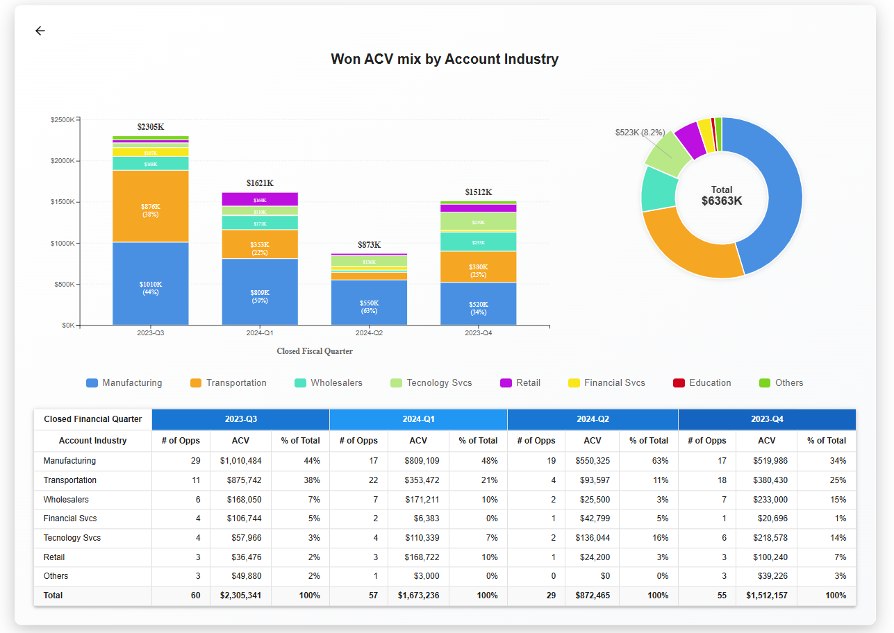

This is a fullstack web application built with:

-  **React** for the frontend (located in `/client`)
-  **Express.js** for the backend API (located in `/server`)



## 🎥 Demo

Watch the walkthrough on Loom: [Click here to view the demo](https://www.loom.com/share/3ae2c731f6304b438fdb3ef3b7250819?sid=4c762507-5314-4be1-912e-e01e58273a03)

---

## 🛠 Getting Started

Follow the steps below to set up and run the project locally.

### 1. Clone the repository

```bash
git clone https://github.com/shaajiiii/skyGeni.git
cd skyGeni
```

---

### 2. Install dependencies

#### Backend

```bash
cd server
yarn install
```

#### Frontend

```bash
cd ../client
yarn install
```

---

### 3. Run the application

Open two terminal windows or tabs:

#### Run the backend

```bash
cd server
yarn dev
```

#### Run the frontend

```bash
cd client
yarn dev
```

---


## 📝 Notes

- The frontend runs on [http://localhost:3000](http://localhost:5173)
- The backend runs on [http://localhost:5000](http://localhost:5000)

---


### ⚙️ Frontend Behavior & Assumptions

- The application is made slightly responsive for mobile devices. 
- When the dataset becomes crowded, especially with **callout lines**, they are displayed **only on hover** under certain conditions to keep the UI clean.
- In bar chart segments:
  - If the figure (label/value) is **too small to display clearly**, it is **intentionally hidden** to avoid visual clutter.
  - This behavior is based on visual clarity assumptions made during development.


